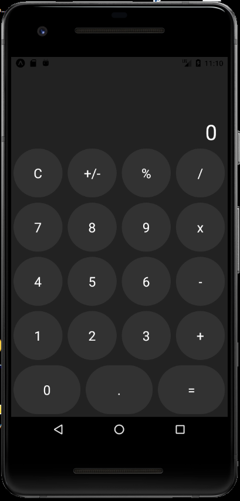

# Lab 1

<h2> Kalkulator </h2>




<p>Kalkulator został zrobiony na wzór tego z serii telefonów Iphone</p>

<h2> Klasa App </h2>


```js
import { StatusBar } from 'expo-status-bar';
import React, {useState} from 'react';
import {SafeAreaView, StyleSheet, Text, View} from 'react-native';
import Row from './components/Row';
import Button from './components/Button';


export default function App() {
  const [currVal, setCurrVal] = useState("0")
  const [operator, setOperator] = useState(null)
  const [preVal, setPreVal] = useState(null)
  const handleTap = (type, value) => {
    
    if(type === 'number'){
      if(currVal === "0")
      {
        setCurrVal(`${value}`)
      }
      else{
      setCurrVal(`${currVal}${value}`)
      }
    }

    if(type === 'operator'){
      setOperator(value)
      setCurrVal("0")
      setPreVal(currVal)
      
    }

    if(type === 'clear'){
      setCurrVal("0")
      setOperator(null)
      setPreVal(null)
    }

    if(type === 'posneg'){
      setCurrVal(`${parseFloat(currVal) * -1}`)
    }

    if(type === 'percentage'){
      setCurrVal(`${parseFloat(currVal) * 0.01}`)
    }

    if(type === 'equal'){

      const current = parseFloat(currVal)
      const previous = parseFloat(preVal)

      if(operator === '+'){
        setCurrVal(previous + current)
        setOperator(null)
        setPreVal(null)
      }

      if(operator === '/'){
        setCurrVal(previous / current)
        setOperator(null)
        setPreVal(null)
      }

      if(operator === '-'){
        setCurrVal(previous - current)
        setOperator(null)
        setPreVal(null)
      }

      if(operator === '*'){
        setCurrVal(previous * current)
        setOperator(null)
        setPreVal(null)
      }
    }
  }
  return (
    <View style={styles.container}>
      <StatusBar style="auto" />
      <SafeAreaView>
         <Text style={styles.value}>{currVal}</Text>
         <Row>
           <Button text="C" onPress={() => handleTap('clear')}/>
           <Button text="+/-" onPress={() => handleTap('posneg')}/>
           <Button text="%" onPress={() => handleTap('percentage')}/>
           <Button text="/" onPress={() => handleTap('operator','/')}/>
          </Row>
          <Row>
           <Button text="7" onPress={() => handleTap('number', 7)}/>
           <Button text="8" onPress={() => handleTap('number', 8)}/>
           <Button text="9" onPress={() => handleTap('number', 9)}/>
           <Button text="x" onPress={() => handleTap('operator', '*')}/>
          </Row>
          <Row>
           <Button text="4" onPress={() => handleTap('number', 4)}/>
           <Button text="5" onPress={() => handleTap('number', 5)}/>
           <Button text="6" onPress={() => handleTap('number', 6)}/>
           <Button text="-" onPress={() => handleTap('operator', '-')}/>
          </Row>
          <Row>
           <Button text="1" onPress={() => handleTap('number', 1)}/>
           <Button text="2" onPress={() => handleTap('number', 2)}/>
           <Button text="3" onPress={() => handleTap('number', 3)}/>
           <Button text="+" onPress={() => handleTap('operator', '+')}/>
          </Row>
          <Row>
           <Button text="0" onPress={() => handleTap('number', 0)}/>
           <Button text="." onPress={() => handleTap('numer', '.')}/>
           <Button text="=" onPress={() => handleTap('equal')}/>
          </Row>
          
         
      </SafeAreaView>
    </View>
  );
}

const styles = StyleSheet.create({
  container: {
    flex: 1,
    backgroundColor: '#202020',
    justifyContent: 'flex-end',
  },
  value: {
    color: '#fff',
    fontSize: 40,
    textAlign: 'right',
    marginRight: 20
  }
});

```
# Komponenty Button oraz Row 

<h2>Button </h2>

```js
import React from 'react'
import { Dimensions, StyleSheet, Text, TouchableOpacity} from 'react-native'

const screen = Dimensions.get("window")
const buttonWidth = screen.width / 4
const Button = ({onPress, text}) => {
    
    return (
        <TouchableOpacity onPress={onPress} style={styles.button}>
            <Text style={styles.text}>{text}</Text>
        </TouchableOpacity>
    )
}


const styles = StyleSheet.create({
    text: {
        color:'#fff',
        fontSize: 25
    },
    textSecondary:{
        color: '#060606'

    },
    button: {
        backgroundColor: '#333333',
        flex: 1,
        height: buttonWidth - 10,
        alignItems: 'center',
        justifyContent: 'center',
        borderRadius: buttonWidth,
        margin: 5
    },
})

export default Button

```

<h2>Row </h2>

```js
import React from 'react'
import { StyleSheet, View } from 'react-native'

const Row = ({children}) => {
    return (
        <View style={{flexDirection: 'row'}}>{children}</View>
    )
}

const styles = StyleSheet.create({})

export default Row
```


hgjghjghj
