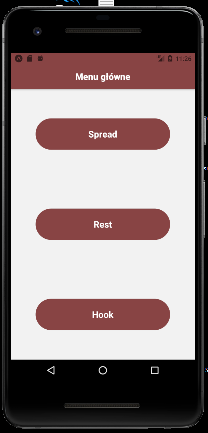
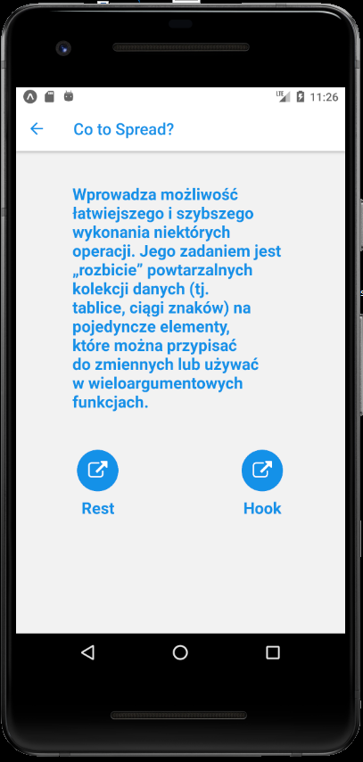
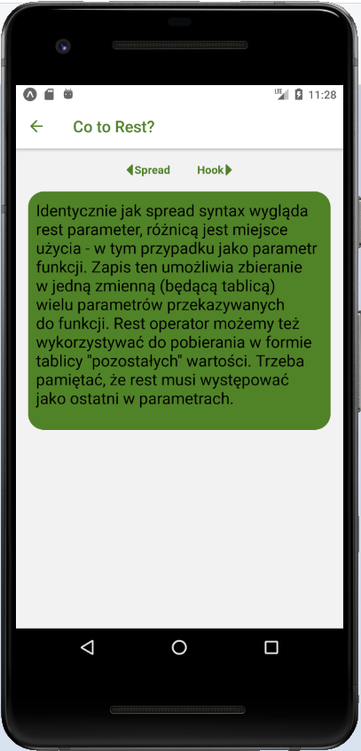
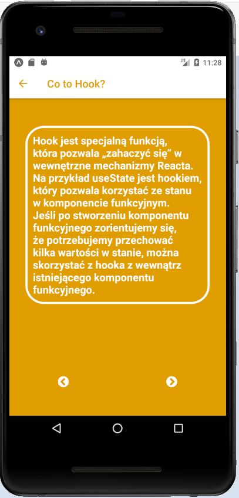

# Lab 2

<h2> Layouty + Nawigacja </h2>

<p>Z menu głównego wybieramy interesujące nas hasło, aby wyskoczył nam opis</p>



```js
import React from 'react';
import { TouchableOpacity, Text, View, StyleSheet} from 'react-native';
import styles from './styles';

export default function start({ navigation }) {
  return (
    <View style={styles.startView}>
        <TouchableOpacity style={styles.startButton} onPress={() => navigation.push('Spread')}>
            <Text style={styles.startText}>Spread</Text>
        </TouchableOpacity >
        <TouchableOpacity style={styles.startButton}  onPress={() => navigation.push('Rest')}>
            <Text style={styles.startText} >Rest</Text>
        </TouchableOpacity >
        <TouchableOpacity style={styles.startButton}  onPress={() => navigation.push('Hook')}>
            <Text style={styles.startText}>Hook</Text>
        </TouchableOpacity >
    </View>
  );
}
```


# Spread </h2>


```js
import React from 'react';
import { Text, View, TouchableOpacity } from 'react-native';
import styles from './styles';
import { Icon } from 'react-native-elements'


export default function spread({ navigation }) {
  return (
    <View>
      <View style={styles.spreadDescription} >
        <Text style={styles.spreadText}>Wprowadza możliwość łatwiejszego i szybszego wykonania niektórych operacji. Jego zadaniem jest „rozbicie” powtarzalnych kolekcji danych (tj. tablice, ciągi znaków) na pojedyncze elementy, które można przypisać do zmiennych lub używać w wieloargumentowych funkcjach.</Text>
      </View>

      <View style={styles.spreadView}>
        <TouchableOpacity style={styles.viewAlign}  onPress={() => navigation.push('Rest')}>
          <Icon reverse
            name='external-link'
            type='font-awesome'
            color='#1791e8'
          />
          <Text style={styles.spreadText}>Rest</Text>
        </TouchableOpacity >
        <TouchableOpacity style={styles.viewAlign} onPress={() => navigation.push('Hook')}>
          <Icon reverse
            name='external-link'
            type='font-awesome'
            color='#1791e8'
          />
          <Text style={styles.spreadText} >Hook</Text>
        </TouchableOpacity >
      </View>


      
    </View>
  );
}
```


#Rest

```js
import React from 'react';
import { Text, TouchableOpacity, View } from 'react-native';
import styles from './styles';
import { Icon } from 'react-native-elements'


export default function rest({ navigation }) {
  return (
    <View style={styles.viewAlign}>
      <View style={styles.restView}>
        <TouchableOpacity style={styles.restButton} onPress={() => navigation.push('Spread')}>
          <Icon
            name='caret-left'
            type='font-awesome'
            color='#518226'
          />
          <Text style={styles.restStyle}>Spread</Text>
        </TouchableOpacity>

        <TouchableOpacity style={styles.restButton} onPress={() => navigation.push('Hook')}>
          <Text style={styles.restStyle}>Hook</Text>
          <Icon
            name='caret-right'
            type='font-awesome'
            color='#518226'
          />
        </TouchableOpacity>
      </View> 
      <View style={styles.restText}>
        <Text style={{fontSize: 20}}>Identycznie jak spread syntax wygląda rest parameter, różnicą jest miejsce użycia - w tym przypadku jako parametr funkcji. Zapis ten umożliwia zbieranie w jedną zmienną (będącą tablicą) wielu parametrów przekazywanych do funkcji. Rest operator możemy też wykorzystywać do pobierania w formie tablicy "pozostałych" wartości. Trzeba pamiętać, że rest musi występować jako ostatni w parametrach.</Text>
      </View>
    </View>
  );
}
```

#Hook


```js
import React from 'react';
import { Text, TouchableOpacity, View } from 'react-native';
import styles from './styles';
import { Icon } from 'react-native-elements'


export default function hook({ navigation }) {
  return (
    <View style={styles.hookView}>


      <View style={styles.viewAlign}>
        <View style={styles.hookBorderText}>
          <Text style={styles.hookText} >Hook jest specjalną funkcją, która pozwala „zahaczyć się” w wewnętrzne mechanizmy Reacta. Na przykład useState jest hookiem, który pozwala korzystać ze stanu w komponencie funkcyjnym. Jeśli po stworzeniu komponentu funkcyjnego zorientujemy się, że potrzebujemy przechować kilka wartości w stanie, można skorzystać z hooka z wewnątrz istniejącego komponentu funkcyjnego.</Text>
        </View>
      </View>

      <View style={styles.hookButton}>
        <TouchableOpacity onPress={() => navigation.push('Spread')}>
          <Icon
            name='chevron-circle-left'
            type='font-awesome'
            color='#ffffff'
          />
        </TouchableOpacity >


        <TouchableOpacity onPress={() => navigation.push('Rest')}>

        <Icon
          name='chevron-circle-right'
          type='font-awesome'
          color='#ffffff'
        />
        </TouchableOpacity>
      </View>
    </View>
  );
}
```

#App.js
```js
import React from 'react';
import {StyleSheet} from 'react-native';
import { NavigationContainer } from '@react-navigation/native';
import { createStackNavigator } from "@react-navigation/stack";
import  start  from './components/start'
import  spread  from './components/spread'
import  rest  from './components/rest'
import  hook  from './components/hook'


const Stack = createStackNavigator();


export default function App() {
  return (
    <NavigationContainer>
      <Stack.Navigator initialRouteName="Menu">
        <Stack.Screen name="Menu" component={start} options={
          {  
            title: 'Menu główne', 
            headerTintColor: '#ffffff', 
            headerStyle: {
              backgroundColor: '#884444',
            },
            headerTitleStyle: {
              fontWeight: 'bold',
              alignSelf: 'center'
            },
            }}/>
        <Stack.Screen name="Spread" component={spread} options={{  title: 'Co to Spread?', headerTintColor: '#1791e8' }} />
        <Stack.Screen name="Rest" component={rest} options={{ title: 'Co to Rest?', headerTintColor: '#518226' }}/>
        <Stack.Screen name="Hook" component={hook} options={{ title: 'Co to Hook?', headerTintColor: '#e09d00'}}/>
      </Stack.Navigator>
    </NavigationContainer>
  );
};
```

# styles.js
```js
import { StyleSheet } from 'react-native';


const styles = StyleSheet.create({
    startView: {
      flex: 1,
      flexDirection: 'column',
      justifyContent: 'space-around',
      alignItems: 'center'
  
    },
    startButton: {
      height: 70,
      width: 300,
      backgroundColor: '#884444',
      alignItems: "center",
      justifyContent: "center",
      borderRadius: 40,
    },
    startText: {
      fontSize : 20,
      color: '#ffffff',
      fontWeight: 'bold',
    },
    
    spreadView:{
        flexDirection: 'row',
        justifyContent: 'space-around',
    },
    spreadText:{
        fontWeight: 'bold',
        color: '#1791e8',
        fontSize: 20
    },
    spreadDescription:{
        width: 350,
        alignSelf: 'center',
        padding: 40
    },


    restStyle:{
        fontWeight: 'bold',
        color: '#518226',
        padding: 2
    },
    restButton:{
        
        flexDirection: 'row',
        padding: 15
    },
    restView:{
        flexDirection: 'row',
    },
    restText:{
        backgroundColor: '#518226',
        height: 300,
        width: 380,
        borderRadius: 20,
        padding: 10,
    },


    hookView:{
        backgroundColor: '#e09d00',
        flex: 1,
        justifyContent: 'space-around',
        

    },
    hookButton:{
        flexDirection: 'row',
        justifyContent: 'space-around',
        marginTop: 30
    },
    hookBorderText:{
        borderWidth: 4,
        borderColor: '#ffffff',
        borderRadius: 35,
        padding: 10,
        width: 350,
    },
    viewAlign:{
        alignItems: "center",
    },
    hookText:{
        color: '#ffffff', 
        fontWeight: 'bold', 
        fontSize: 20
    }
    

  })

  export default styles;
```
