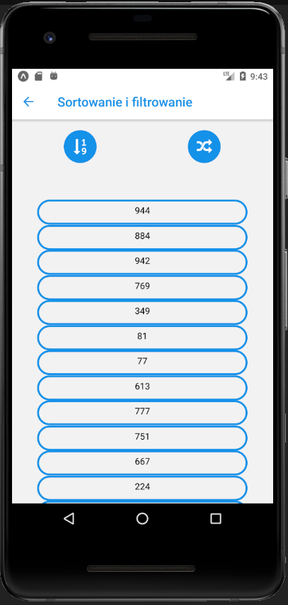
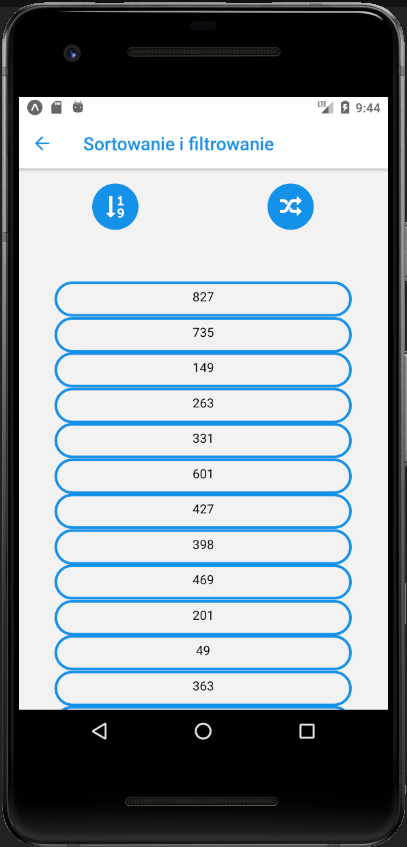
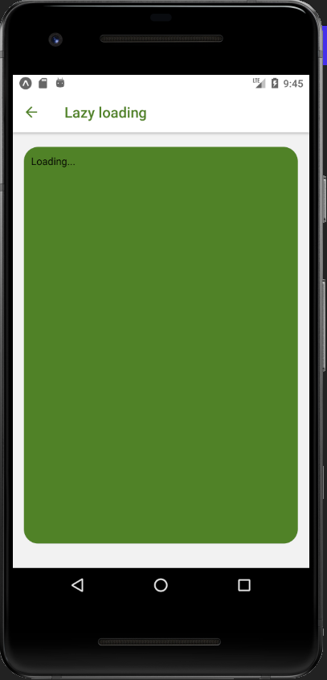

# Lab 3

<h2> Renderowanie listy danych + obsługa progresu </h2>

<p>Z menu głównego wybieramy interesujące nas podzadanie, które było do wykonania w Lab3</p>


# Sortowanie i filtrowanie 

<p>Zostaje wygenerowana losowa tablica 100 liczb </p>

<br>
<p>Po wciśnięciu odpowiedniej ikony zostaje wygenerowana nowa tablica</p>

<br>
<p>Podczas operacji sortowania, nasza tablica zostaje uporządkowana od najmniejszej liczby do największej</p>


<p>Sort.js</p>

```js
import React, { Component } from 'react';
import { Text, View, TouchableOpacity } from 'react-native';
import styles from './styles';
import { Icon } from 'react-native-elements'
import { ScrollView } from 'react-native-gesture-handler';


const Array = ({ liczby }) => {
  var nr = 0
      return (
          <ScrollView >
           {liczby.map(liczba => <Text style={styles.sortArray} key={nr++} >{liczba}</Text>)}
          </ScrollView>
      );
};


export default class Sort extends Component {


  constructor() {
    super()
    const array = []


    for (let i = 0; i < 100; i++) {
      array.push(Math.floor(Math.random() * 1000)+1)
    }

    this.state = { 
      array 
    };

  }

  
  sort = () =>{
      this.state.array.sort((a,b) => a > b ? 1:-1)
      this.forceUpdate()
  }

  new = () => {
    const newArray = [];
    for (let j = 0; j < 100; j++) {
      newArray.push(Math.floor(Math.random() * 1000)+1)
    }

    this.state.array = newArray
    this.forceUpdate()

  }


  render(){
    return (
      <View>
        <View style={styles.sortButtons} >

          <TouchableOpacity onPress={this.sort}>
             <Icon reverse
               name='sort-numeric-asc'
               type='font-awesome'
               color='#1791e8'
             />
          </TouchableOpacity>

          <TouchableOpacity onPress={this.new}>
             <Icon reverse
               name='random'
               type='font-awesome'
               color='#1791e8'
             />
          </TouchableOpacity>
        </View>

        <View style={styles.sortViewArray}>
          <Array liczby={this.state.array} />
        
        </View>
      </View>
    );
  }
}

```


# Lazy loading


<br>
<p>Niżej zostają załadowane pseudolosowe litery metodą lazy loading.</p>


<p>Lazy.js</p>

```js
import React, { Component, Suspense } from 'react';
import { Text, TouchableOpacity, View } from 'react-native';
import styles from './styles';


const LazyComp = React.lazy(() => import('./Load'))

export default class Lazy extends Component {
  render(){
    return (
      <View style={styles.lazyAlign}>
         
        <View style={styles.lazyText}>

            <Suspense fallback={<Text>Loading...</Text>}>
              <LazyComp length="100000"/>
            </Suspense>
        
        </View>
      </View>
  );
  }
}
```

<p>Load.js</p>

```js
import React, {Component} from 'react';
import {Text, View} from 'react-native';
import { ScrollView } from 'react-native-gesture-handler';

export default class ComponentToLoad extends Component {
    constructor(props){
        super(props)

        const n = props.length ? props.length : 0
        
        const znaki ='ABCDEFGHIJKLMNOPQRSTUVWXYZabcdefghijklmnopqrstuvwxyz0123456789';
        let ciag = ' ';
        const znakiN = znaki.length;
        for ( let i = 0; i < n; i++ ) {
            ciag += znaki.charAt(Math.floor(Math.random() * znakiN));
        }

        this.state = { text: ciag }
    }
    render(){ 
        return (
            <ScrollView>
                <Text>{this.state.text}</Text>
            </ScrollView>
        )
    };
}
```

# Step

<br>
<p>Każdy z poniższych ekranów ma zmienioną ikonę ładowania.</p>


```js
import React, { Component } from 'react';
import { Text, ActivityIndicator, View } from 'react-native';
import { ProgressSteps, ProgressStep } from 'react-native-progress-steps';
import styles from './styles';


export default class Step extends Component {
  render(){
    const stepButton = {
      color: '#ffffff',
      fontWeight: 'bold'
    };
    const ikonyStyle = {
            activeStepIconBorderColor: '#ffffff',
            activeLabelColor: '#ffffff',
            activeStepNumColor: 'white',
            activeStepIconColor: '#ffffff',
            completedStepIconColor: '#ffffff',
            completedProgressBarColor: '#ffffff',
            completedCheckColor: '#e09d00'
          };

   
    return (
      <View style={styles.hookView}>


        <View style={{flex: 1}}>
        <ProgressSteps {...ikonyStyle}>

        <ProgressStep label="Strona pierwsza" previousBtnTextStyle={stepButton} nextBtnTextStyle={stepButton}>
            <View style={{ alignItems: 'center' }}>
            </View>
            <ActivityIndicator size="large" color="#654336" />
        </ProgressStep>


        <ProgressStep label="Strona druga" previousBtnTextStyle={stepButton} nextBtnTextStyle={stepButton}>
            <View style={{ alignItems: 'center' }}>
            </View>
            <ActivityIndicator size = "large" color = '#ffffff'/>
        </ProgressStep>


        <ProgressStep label="Strona trzecia" previousBtnTextStyle={stepButton} nextBtnTextStyle={stepButton} >
            <View style={{ alignItems: 'center' }}>
            </View>
            <ActivityIndicator size="small" color="#ff0000" />
        </ProgressStep>


        </ProgressSteps>
        </View>

      </View>
    );
  }
}
```


# styles.js

```js
import { StyleSheet } from 'react-native';


const styles = StyleSheet.create({
    startView: {
      flex: 1,
      flexDirection: 'column',
      justifyContent: 'space-around',
      alignItems: 'center'
  
    },
    startButton: {
      height: 70,
      width: 300,
      backgroundColor: '#884444',
      alignItems: "center",
      justifyContent: "center",
      borderRadius: 40,
    },
    startText: {
      fontSize : 20,
      color: '#ffffff',
      fontWeight: 'bold',
    },

    
    
    sortViewArray:{
       padding: 40,
       
       
    },
    sortButtons:{
        flexDirection: 'row',
        padding: 10,
        justifyContent: 'space-around',
    },
    sortArray:{
        borderColor: '#1791e8',
        borderRadius: 20,
        borderWidth: 3,
        padding: 7,
        textAlign:'center',
    },


    lazyAlign:{
        alignItems: "center",
        paddingTop: 20,
    },

    lazyText:{
        backgroundColor: '#518226',
        height: 550,
        width: 380,
        borderRadius: 20,
        padding: 10,
    },


    hookView:{
        backgroundColor: '#e09d00',
        flex: 1,
        justifyContent: 'space-around',
        

    },
    
    

  })

  export default styles;
```

