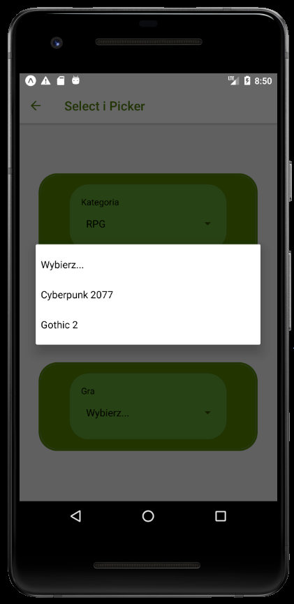
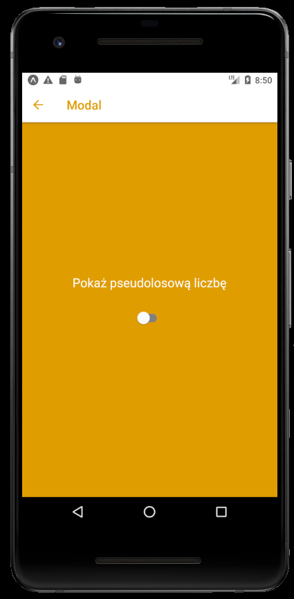
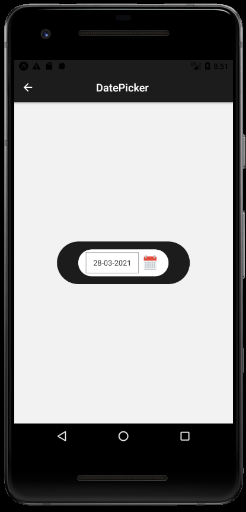
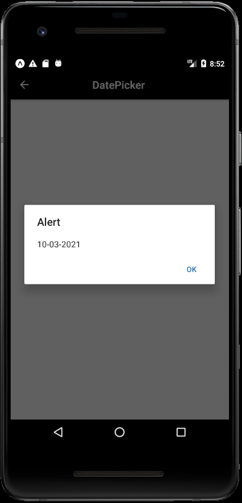

# Lab 4

<h2> Obsługa danych wprowadzanych przez użytkownika + modale </h2>

<p>Z menu głównego wybieramy interesujące nas podzadanie, które było do wykonania w Lab4</p>


# TextInput 

<p>Zostało wprowadzonych 5 Textinputów, które różnią się od siebie właściwościami opisanymi w odpowiednim miejscu.</p>

<br>


<p>TextInput.js</p>

```js
import React, { Component } from 'react';
import { Text, View, TextInput } from 'react-native';
import styles from './styles';
import { Icon } from 'react-native-elements'
import { ScrollView } from 'react-native-gesture-handler';


export default class TextInputComp extends Component {

  render(){
    return (
      <View style={styles.TextInputView}>
        <View style={styles.TextInputViewText}>
          <Text style={styles.TextInputText}>1 - Bez zmian</Text>
          <TextInput style={styles.TextInput}/>
        </View>

        <View style={styles.TextInputViewText}>
          <Text style={styles.TextInputText}>2 - Placeholder</Text>
          <TextInput style={styles.TextInput} placeholder="Uzupełnij tutaj..."/>
        </View>

        <View style={styles.TextInputViewText}>
          <Text style={styles.TextInputText}>3 - Limit znaków (3)</Text>
          <TextInput style={styles.TextInput} maxLength={3}/>
        </View>

        <View style={styles.TextInputViewText}>
          <Text style={styles.TextInputText}>4 - Blokada uzupełnienia</Text>
          <TextInput style={styles.TextInput} editable={false} />
        </View>

        <View style={styles.TextInputViewText}>
          <Text style={styles.TextInputText}>5 - Odblokowane uzupełnianie w nowej lini</Text>
          <TextInput style={styles.TextInput} multiline={true} />
        </View>
      </View>
    )
  }
}
```


# Select i Picker


<br>
<p>Każda z kategorii ma unikalny zestaw gier, które mogą się powtarzać.</p>

<br>


<p>SelectPicker.js</p>

```js
import React, { useState } from 'react';
import { View } from 'react-native';
import Select from "./Select";
import styles from './styles';


export default function SelectPicker(){
  const [category, setCategory] = useState([
    { label: "Wybierz...", value: null },
    { label: "FPS", value: "FPS" },
    { label: "Akcji", value: "Akcji" },
    { label: "RTS", value: "RTS" },
    { label: "RPG", value: "RPG" },
    { label: "Wyścigowa", value: "Wyscigowa" }
  ]);
  const [games, setGames] = useState([
    { label: "Wybierz...", value: null, category: ["FPS", "Akcji", "RTS", "RPG", "Wyscigowa"] },
    { label: "Cyberpunk 2077", value: 1, category: ["RPG", "FPS", "Akcji"] },
    { label: "Gothic 2", value: 2, category: ["RPG", "Akcji"] },
    { label: "Counter-Strike", value: 3, category: ["FPS"] },
    { label: "Command & Conquer", value: 4, category: ["RTS"] },
    { label: "Need For Spead Heat", value: 5, category: ["Wyscigowa", "Akcji"] },
    { label: "Starcraft 2", value: 6, category: ["RTS", "Akcji"] },

  ]);
  const [availableGames, setAvailableGames] = useState([]);
  const [selectedCategory, setSelectedCategory] = useState(null);
  const [selectedGames, setSelectedGames] = useState(null);
  const [selection, setSelection] = useState("");

  return (
    <View style={styles.SelectPickerView}>
      <View style={styles.SelectPickerViewText}>
        <View style={styles.SelectPickerViewText2}>
          <Select
            label="Kategoria"
            items={category}
            selectedValue={selectedCategory}
            onValueChange={size => {
              setSelectedCategory(size);
              setSelectedGames(null);
              setAvailableGames(games.filter(i => i.category.includes(size)));
            }}
          />
        </View>
      </View>
      <View style={styles.SelectPickerViewText}>
        <View style={styles.SelectPickerViewText2}>
          <Select
            label="Gra"
            items={availableGames}
            selectedValue={selectedGames}
            onValueChange={garment => {
              setSelectedGames(garment);
              setSelection(
                `${selectedCategory} ${games.find(i => i.value === garment).label}`
              );
            }}
          />
        </View>
      </View>
    </View>
  );
}

```


# Modal

<br>
<p>Po interakcji ze switchem zostaje wygenerowana liczba pseudolosowa</p>



<p>Modal.js</p>

```js
import React, { useState } from 'react';
import { Text, View, Modal, TouchableOpacity, Switch} from 'react-native';
import styles from './styles';
import { Icon } from 'react-native-elements'


export default function ModalComp() {
  const [modalVisible, setModalVisible] = useState(false);
    return (
      <View style={styles.ModalView}>
        <Modal
          animationType="fade"
          visible={modalVisible}
          onRequestClose={() => {
            setModalVisible(!modalVisible);
          }}>
          <View style={styles.ModalViewIn}>
            <View style={{top: 28}}>
              <Text style={styles.ModalText}>{Math.floor(Math.random()*100)}</Text>
              <TouchableOpacity 
              onPress={() => setModalVisible(false)}>
                <Icon raised
                  name='times'
                  type='font-awesome'
                  color='#e09d00'
                />
              </TouchableOpacity>
            </View>
          </View>
        </Modal>
        <Text style={styles.ModalText}>Pokaż pseudolosową liczbę</Text>
        <Switch 
        trackColor={{true: 'white', false: 'grey'}}
        thumbColor='#FFF'
        value={modalVisible} 
        onValueChange={() => setModalVisible(true)}
        />
      </View>
    );
  }
```


# DatePicker

<br>
<p>Po wybraniu daty, wyskakuje odpowiedni alert z wybraną datą.</p>




<p>DatePicker.js</p>

```js
import React, { Component } from 'react';
import { View } from 'react-native';
import styles from './styles';
import DatePicker from 'react-native-datepicker'


export default class DatePickerComp extends Component {
  constructor(props){
    super(props)
    this.state = {date: new Date()}
}
  render(){
    return (
      <View style={styles.DatePickerView}>
        <View style={styles.DatePickerViewCal}>
          <View style={styles.DatePickerViewCalMid}>
            <DatePicker style={{alignSelf: 'center'}}
                date={this.state.date}
                mode="date"
                format="DD-MM-YYYY"
                onDateChange={(date) => {
                    this.setState({date: date});
                    alert(this.state.date)
                }}
            />
          </View>
        </View>
      </View >
  );
  }
}

```


# ToastAndroid

<br>
<p>Po wciśnięciu ikonki, dostajemy informację o wymaganym czasie do wyłączenia się modala.</p>


<p>ToastAndroid.js</p>

```js
import React, { Component, useEffect, useState} from 'react';
import {View, Text, Modal,ToastAndroid, TouchableOpacity, ActivityIndicator  } from 'react-native';
import { useNavigation } from '@react-navigation/native';
import { Icon } from 'react-native-elements'
import styles from './styles';

export default function(props) {
  const navigation = useNavigation();
  return <ToastAndroidComp {...props} navigation={navigation} />;
}

const ToastButton = () => {
const [visible, setvisible] = React.useState(false);
const [switchOn, setswitchOn] = React.useState(false);
const [time, setTime] = useState(0);

useEffect(() => setvisible(false), [visible]);

const handleButtonPress = () => {
  setvisible(true);
};

const onToggleSwitch = () => {
  setswitchOn(!switchOn);
};


var promise = null
const createPromise = () => {
  let time = Math.floor(Math.random()*10000)
  setTime(time)
  promise = new Promise((resolve, reject) => {
      setTimeout(() => {
          resolve('ukryj');
      }, time);
  });
}

return (
  <View >
      <Toast visible={visible} />
      
      

        <TouchableOpacity 
        onPress={() => {
          onToggleSwitch()
          handleButtonPress()
          createPromise()
          promise.then((value) => {
              if(value == 'ukryj'){
                  setswitchOn(false)
              }
          });
        }}>
          <Icon raised
            name='clock-o'
            type='font-awesome'
            color='#7a0ce9'
          />
        </TouchableOpacity>

      <Modal
          animationType="fade"
          visible={switchOn}
          onRequestClose={() => {
              setModalVisible(!switchOn);
          }}
      >
          <View style={styles.ToastViewIn} >
              <View style={styles.ToastViewInMid}>
                  <Text style={styles.ToastText} onPress={onToggleSwitch} >Modal wyłączy się za {time/1000} sekund</Text>
              </View>
              <ActivityIndicator style={{top:50}} size="large" color="#fff" />
          </View>
      </Modal> 
  </View>
);
};

const Toast = ({ visible}) => {
  if (visible) {
      ToastAndroid.showWithGravityAndOffset(
          "Loading",
          ToastAndroid.LONG,
          ToastAndroid.CENTER,
          0,
          500
      );
  }
  return null;
};


class ToastAndroidComp extends Component {
  render(){
    return (
      <View style={styles.ToastView}>
        <ToastButton />
      </View>
    );
  }
}

```


<p>DatePicker.js</p>

```js
import React, { Component } from 'react';
import { View } from 'react-native';
import styles from './styles';
import DatePicker from 'react-native-datepicker'


export default class DatePickerComp extends Component {
  constructor(props){
    super(props)
    this.state = {date: new Date()}
}
  render(){
    return (
      <View style={styles.DatePickerView}>
        <View style={styles.DatePickerViewCal}>
          <View style={styles.DatePickerViewCalMid}>
            <DatePicker style={{alignSelf: 'center'}}
                date={this.state.date}
                mode="date"
                format="DD-MM-YYYY"
                onDateChange={(date) => {
                    this.setState({date: date});
                    alert(this.state.date)
                }}
            />
          </View>
        </View>
      </View >
  );
  }
}

```


# ToastAndroid

<br>
<p>Po wciśnięciu ikonki, dostajemy informację o wymaganym czasie do wyłączenia się modala.</p>


# styles.js

```js
import { StyleSheet } from 'react-native';


const styles = StyleSheet.create({
    startView: {
      flex: 1,
      flexDirection: 'column',
      justifyContent: 'space-around',
      alignItems: 'center'
  
    },
    startButton: {
      height: 70,
      width: 300,
      backgroundColor: '#884444',
      alignItems: "center",
      justifyContent: "center",
      borderRadius: 40,
    },
    startText: {
      fontSize : 20,
      color: '#ffffff',
      fontWeight: 'bold',
    },

    TextInput: {
      backgroundColor: '#8BC8F3',
      borderRadius: 15,
      textAlign: 'center',
    },
    TextInputText: {
      top: -5,
      color: '#ffffff',
      alignSelf: 'center'
    },

    TextInputView: {
      flex: 1,
      justifyContent: 'space-around',
      alignItems: 'center'
    },
    TextInputViewText: {
        borderColor: '#1791e8',
        backgroundColor: '#1791e8',
        borderRadius: 30,
        borderWidth: 3,
        padding: 15,
        width: 350,
    },
    SelectPickerView: {
      flex: 1,
      justifyContent: 'space-around',
      alignItems: 'center'

    },
    SelectPickerViewText: {
      borderColor: '#518226',
      backgroundColor: '#518226',
      borderRadius: 30,
      borderWidth: 3,
      padding: 15,
      width: 350,
      alignItems: 'center',
    },
    SelectPickerViewText2: {
      borderColor: '#65a230',
      backgroundColor: '#65a230',
      borderRadius: 30,
      borderWidth: 3,
      padding: 15,
      width: 250,
    },
    ModalView:{
      backgroundColor: '#e09d00',
      flex: 1,
      alignItems: "center",
      justifyContent: 'center',
      padding: 60
    },
    ModalViewIn:{
      backgroundColor: '#e09d00',
      flex: 1,
      justifyContent: "center",
      alignItems: "center",
      
    },
    ModalText: {
      color: '#ffffff',
      alignSelf: 'center',
      fontSize: 20,
      top: -30
    },
    DatePickerView:{
      flex: 1,
      justifyContent: 'space-around',
      alignItems: 'center'
    },
    DatePickerViewCal:{
      borderColor: '#1a1a1a',
      backgroundColor: '#1a1a1a',
      borderRadius: 40,
      padding: 15,
      width: 250,
      alignItems: 'center'
    },
    DatePickerViewCalMid:{
      borderColor: '#ffffff',
      backgroundColor: '#ffffff',
      borderRadius: 30,
      width: 170,
      height: 50,
      justifyContent: "center",
    },
    ToastView:{
      backgroundColor: '#7a0ce9',
      flex: 1,
      alignItems: "center",
      justifyContent: 'center',
      padding: 60
    },
    ToastViewIn:{
      backgroundColor: '#7a0ce9',
      flex: 1,
      alignItems: "center",
      justifyContent: 'center',

    },
    ToastViewInMid:{
      borderColor: '#ffffff',
      backgroundColor: '#ffffff',
      borderRadius: 30,
      width: 250,
      height: 70,
      justifyContent: "center",
    },
    ToastText:{
      textAlign: 'center',
      fontSize: 14
    },
    
  })

  export default styles;

```


