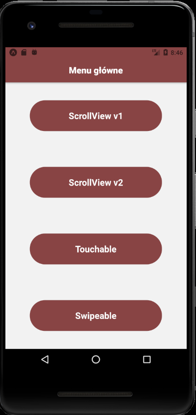
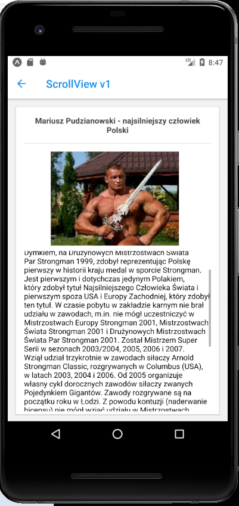
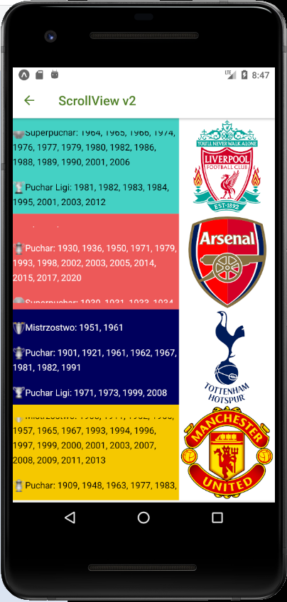
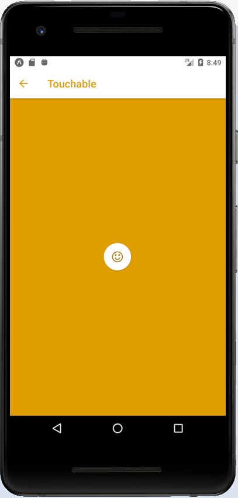
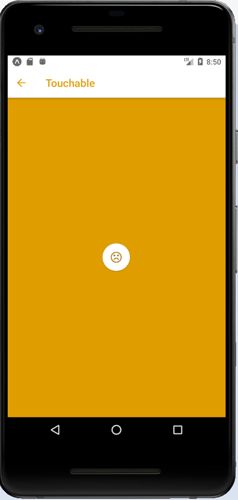
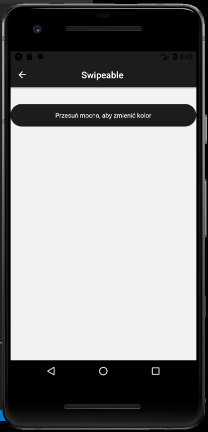
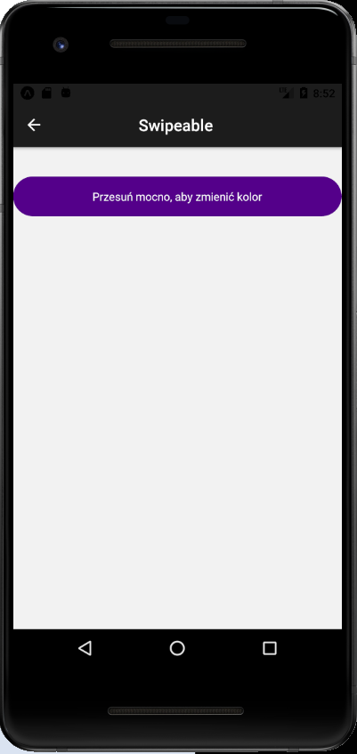

# Lab 5

<h2> Obsługa gestów użytkownika </h2>

<p>Z menu głównego wybieramy interesujące nas podzadanie, które było do wykonania w Lab5</p>




# ScrollView 

<p>Na pierwszym ekranie została wprowadzona informacja o polskim zawodniku PUDZIAN, na drugim zaś osiągnięcia krajowe drużyn sportowych.</p>

<br>

<br>


<p>ScrollViewv1.js</p>

```js
import React, { Component } from 'react';
import {View, Image, Text, ScrollView, } from 'react-native';
import styles from './styles';
import { Card } from 'react-native-elements'


export default class ScrollViewv1Comp extends Component {

  render(){
    return (
      <View>
        <Card>
          <Card.Title>Mariusz Pudzianowski - najsilniejszy człowiek Polski</Card.Title>
            <Card.Divider/>
              <View>
                <Image
                  source={{uri: 'https://i.ibb.co/b28QjL0/6.jpg'}}
                  style={{width: 240,
                  height: 176, 
                  left:50,}}/>
                  
                  <ScrollView style={{top:10, height:300, alignContent:'center',
                    flexDirection: 'column', }}>
                    <Text>
                    W zawodach Strongman zadebiutował 1 maja 1999 podczas konkursu w Płocku. Jest zrzeszony w światowej federacji siłaczy WSMC (The World Strongman Cup Federation).
                    Wraz z Jarosławem Dymkiem, na Drużynowych Mistrzostwach Świata Par Strongman 1999, zdobył reprezentując Polskę pierwszy w historii kraju medal w sporcie Strongman. Jest pierwszym i dotychczas jedynym Polakiem, który zdobył tytuł Najsilniejszego Człowieka Świata i pierwszym spoza USA i Europy Zachodniej, który zdobył ten tytuł.
                    W czasie pobytu w zakładzie karnym nie brał udziału w zawodach, m.in. nie mógł uczestniczyć w Mistrzostwach Europy Strongman 2001, Mistrzostwach Świata Strongman 2001 i Drużynowych Mistrzostwach Świata Par Strongman 2001.
                    Został Mistrzem Super Serii w sezonach 2003/2004, 2005, 2006 i 2007.
                    Wziął udział trzykrotnie w zawodach siłaczy Arnold Strongman Classic, rozgrywanych w Columbus (USA), w latach 2003, 2004 i 2006.
                    Od 2005 organizuje własny cykl dorocznych zawodów siłaczy zwanych Pojedynkiem Gigantów. Zawody rozgrywane są na początku roku w Łodzi.
                    Z powodu kontuzji (naderwanie bicepsu) nie mógł wziąć udziału w Mistrzostwach Polski Strongman 2005 i Mistrzostwach Europy Strongman 2005.
                    14 września 2008 na Mistrzostwach Świata Strongman 2008, pomimo kontuzji, zdobył kolejny tytuł Mistrza Świata Strongman i tym samym stał się pierwszym zawodnikiem posiadającym pięć tytułów Najsilniejszego Człowieka Świata.
                    Największym rywalem Pudzianowskiego na światowych arenach był Litwin, Žydrūnas Savickas, natomiast w obrębie własnej federacji Amerykanin, Derek Poundstone. Od połowy 2006 Pudzianowski nie dążył do pojedynku z Savickasem, a pierwsza sportowa konfrontacja nastąpiła na Mistrzostwach Świata Strongman 2009.
                    28 lutego 2009, podczas Piątego Pojedynku Gigantów, doznał zerwania bicepsu i w wyniku tej kontuzji został na kilka miesięcy wyłączony z zawodów.
                    </Text>
                  </ScrollView>
              </View>
        </Card>
      </View>
    )
  }
}
```

<p>ScrollViewv2.js</p>

```js
import React, { Component } from 'react';
import { View, Image, Text, ScrollView } from 'react-native';
import styles from './styles';


export default class ScrollViewv2Comp extends Component {

  render(){
    return (
      <View>
        <View style={{flexDirection: 'row', backgroundColor: '#45d1c4'}}>

          <ScrollView style={{top:20, height:120}}>
              <Text>
                <Image
                    source={{uri: 'https://upload.wikimedia.org/wikipedia/commons/thumb/4/48/Premier_league_trophy_icon_%28adjusted%29.png/20px-Premier_league_trophy_icon_%28adjusted%29.png'}}
                    style={{width: 20,
                    height: 20,}}/>
                    Mistrzostwo: 1901, 1906, 1922, 1923, 1947, 1964, 1966, 1973, 1976, 1977, 1979, 1980, 1982, 1983, 1984, 1986, 1988, 1990, 2020
              {"\n"}{"\n"}
              <Image
                    source={{uri: 'https://upload.wikimedia.org/wikipedia/commons/thumb/9/91/FA_Cup.png/18px-FA_Cup.png'}}
                    style={{width: 20,
                    height: 20,}}/>
              Puchar: 1965, 1974, 1986, 1989, 1992, 2001, 2006
              {"\n"}{"\n"}
              <Image
                    source={{uri: 'https://upload.wikimedia.org/wikipedia/commons/thumb/3/31/CommunityShield.png/20px-CommunityShield.png'}}
                    style={{width: 20,
                    height: 20,}}/>
              Superpuchar: 1964, 1965, 1966, 1974, 1976, 1977, 1979, 1980, 1982, 1986, 1988, 1989, 1990, 2001, 2006
              {"\n"}{"\n"}
              <Image
                    source={{uri: 'https://upload.wikimedia.org/wikipedia/commons/thumb/6/6c/Carling.png/20px-Carling.png'}}
                    style={{width: 20,
                    height: 20,}}/>
              Puchar Ligi: 1981, 1982, 1983, 1984, 1995, 2001, 2003, 2012
              </Text>
          </ScrollView>
          <Image
                    source={{uri: 'https://m0.joe.co.uk/wp-content/uploads/2016/08/24135800/liverpoolfc.png'}}
                    style={{width: 150,
                    height: 150,}}/>
        </View>

        <View style={{flexDirection: 'row', backgroundColor:'#ed5858'}}>

          <ScrollView style={{top:20, height:120}}>
          <Text style={{color:'white'}}>
                <Image
                    source={{uri: 'https://upload.wikimedia.org/wikipedia/commons/thumb/4/48/Premier_league_trophy_icon_%28adjusted%29.png/20px-Premier_league_trophy_icon_%28adjusted%29.png'}}
                    style={{width: 20,
                    height: 20,}}/>
                    Mistrzostwo: 	1931, 1933, 1934, 1935, 1938, 1948, 1953, 1971, 1989, 1991, 1998, 2002, 2004
              {"\n"}{"\n"}
              <Image
                    source={{uri: 'https://upload.wikimedia.org/wikipedia/commons/thumb/9/91/FA_Cup.png/18px-FA_Cup.png'}}
                    style={{width: 20,
                    height: 20,}}/>
              Puchar: 1930, 1936, 1950, 1971, 1979, 1993, 1998, 2002, 2003, 2005, 2014, 2015, 2017, 2020
              {"\n"}{"\n"}
              <Image
                    source={{uri: 'https://upload.wikimedia.org/wikipedia/commons/thumb/3/31/CommunityShield.png/20px-CommunityShield.png'}}
                    style={{width: 20,
                    height: 20,}}/>
              Superpuchar: 1930, 1931, 1933, 1934, 1938, 1948, 1953, 1991, 1998, 1999, 2002, 2004, 2014, 2015, 2017, 2020
              {"\n"}{"\n"}
              <Image
                    source={{uri: 'https://upload.wikimedia.org/wikipedia/commons/thumb/6/6c/Carling.png/20px-Carling.png'}}
                    style={{width: 20,
                    height: 20,}}/>
              Puchar Ligi: 1987, 1993
              </Text>
          </ScrollView>
          <Image
                    source={{uri: 'https://m0.joe.co.uk/wp-content/uploads/2016/08/24135323/arsenal.png'}}
                    style={{width: 150,
                    height: 150,}}/>
        </View>

        <View style={{flexDirection: 'row', backgroundColor:'#06005e'}}>

          <ScrollView style={{top:20, height:120}}>
          <Text style={{color:'white'}}>
                <Image
                    source={{uri: 'https://upload.wikimedia.org/wikipedia/commons/thumb/4/48/Premier_league_trophy_icon_%28adjusted%29.png/20px-Premier_league_trophy_icon_%28adjusted%29.png'}}
                    style={{width: 20,
                    height: 20,}}/>
                    Mistrzostwo: 1951, 1961
              {"\n"}{"\n"}
              <Image
                    source={{uri: 'https://upload.wikimedia.org/wikipedia/commons/thumb/9/91/FA_Cup.png/18px-FA_Cup.png'}}
                    style={{width: 20,
                    height: 20,}}/>
              Puchar: 1901, 1921, 1961, 1962, 1967, 1981, 1982, 1991
              {"\n"}{"\n"}
              <Image
                    source={{uri: 'https://upload.wikimedia.org/wikipedia/commons/thumb/6/6c/Carling.png/20px-Carling.png'}}
                    style={{width: 20,
                    height: 20,}}/>
              Puchar Ligi: 1971, 1973, 1999, 2008
              </Text>
          </ScrollView>
          <Image
                    source={{uri: 'https://m0.joe.co.uk/wp-content/uploads/2016/08/24135238/tottenham.png'}}
                    style={{width: 150,
                    height: 150,}}/>
        </View>

        <View style={{flexDirection: 'row', backgroundColor:'#f5c800'}}>

          <ScrollView style={{top:20, height:120}}>
          <Text>
                <Image
                    source={{uri: 'https://upload.wikimedia.org/wikipedia/commons/thumb/4/48/Premier_league_trophy_icon_%28adjusted%29.png/20px-Premier_league_trophy_icon_%28adjusted%29.png'}}
                    style={{width: 20,
                    height: 20,}}/>
                    Mistrzostwo: 1908, 1911, 1952, 1956, 1957, 1965, 1967, 1993, 1994, 1996, 1997, 1999, 2000, 2001, 2003, 2007, 2008, 2009, 2011, 2013
              {"\n"}{"\n"}
              <Image
                    source={{uri: 'https://upload.wikimedia.org/wikipedia/commons/thumb/9/91/FA_Cup.png/18px-FA_Cup.png'}}
                    style={{width: 20,
                    height: 20,}}/>
              Puchar: 1909, 1948, 1963, 1977, 1983, 1985, 1990, 1994, 1996, 1999, 2004, 2016
              {"\n"}{"\n"}
              <Image
                    source={{uri: 'https://upload.wikimedia.org/wikipedia/commons/thumb/3/31/CommunityShield.png/20px-CommunityShield.png'}}
                    style={{width: 20,
                    height: 20,}}/>
              Superpuchar: 1908, 1911, 1952, 1956, 1957, 1965, 1967, 1977, 1983, 1990, 1993, 1994, 1996, 1997, 2003, 2007, 2008, 2010, 2011, 2013, 2016
              {"\n"}{"\n"}
              <Image
                    source={{uri: 'https://upload.wikimedia.org/wikipedia/commons/thumb/6/6c/Carling.png/20px-Carling.png'}}
                    style={{width: 20,
                    height: 20,}}/>
              Puchar Ligi: 1992, 2006, 2009, 2010, 2017
              </Text>
          </ScrollView>
          <Image
                    source={{uri: 'https://m0.joe.co.uk/wp-content/uploads/2016/08/24135102/manutd.png'}}
                    style={{width: 150,
                    height: 150,}}/>
        </View>
      </View>
    )
  }
}
```

# Touchable


<br>
<p>Po wciśnięciu TouchableOpacity buźka zmienia się na smutną, dodaną jako TouchableHighlight.</p>
<br>

<br

<p>Touchable.js</p>

```js
import React, { Component } from 'react';
import {View, Text,  Touchable, TouchableOpacity, TouchableHighlight} from 'react-native';
import styles from './styles';
import renderIf from './renderIf'
import { Icon } from 'react-native-elements'


export default class TouchableComp extends Component{

  constructor(){
    super();
    this.state ={
      status:false
    }
  }

  toggleStatus(){
    this.setState({
      status:!this.state.status
    });
  }
  render(){
    return (
      <View style={{backgroundColor: '#e09d00', flex: 1, alignItems: 'center', justifyContent: 'center'}}>
        
        <View>
        {renderIf(!this.state.status)(
          <TouchableOpacity onPress={()=>this.toggleStatus()}>
          <Icon raised
            name='smile-o'
            type='font-awesome'
            color='#a67503'
          />
          </TouchableOpacity>)}


          {renderIf(this.state.status)(
          <TouchableHighlight onPress={()=>this.toggleStatus()}>
          <Icon raised
            name='frown-o'
            type='font-awesome'
            color='#a67503'
          />
          </TouchableHighlight>)}


        </View>


        
      </View>
    );
  }
}

```


# Swipeable

<br>
<p>Po odpowiednio mocnym przesunięciu Swipe, tło zmieni kolor</p>



<p>Swipeable.js</p>

```js
import React, { Component } from 'react';
import { View, Text, ScrollView } from 'react-native';
import styles from './styles';
import Swipeable from 'react-native-swipeable';


class Swipe extends Component {


  state = {
    leftAction: false,
    toggle: false
  };

  render() {
    const {leftAction, toggle} = this.state;

    return (
      <Swipeable
        leftActionActivationDistance={100}
        leftContent={(
          <View>
            {leftAction ?
              <Text style={{ fontWeight: 'bold'}}>Puść!</Text> :
              <Text>Przeciągaj dalej!</Text>}
          </View>
        )}
        onLeftActionActivate={() => this.setState({leftAction: true})}
        onLeftActionDeactivate={() => this.setState({leftAction: false})}
        onLeftActionComplete={() => this.setState({toggle: !toggle})}
      >
        <Text>{"\n"}</Text>
        <View style={[{backgroundColor: toggle ? '#53008a' : '#1a1a1a', height: 50, borderRadius: 50, alignItems: 'center', justifyContent: 'center'}]}>
          <Text style={{color: 'white'}}>Przesuń mocno, aby zmienić kolor</Text>
        </View>
      </Swipeable>
    );
  }
}


export default class SwipeableComp extends Component{
  
  state = {
    currentSwipeable: null
  };

  handleScroll = () => {
    const {currentSwipeable} = this.state;

    if (currentSwipeable) {
      currentSwipeable.recenter();
    }
  };

  render() {
    const {currentSwipeable} = this.state;
    const itemProps = {
      onOpen: (event, gestureState, swipeable) => {
        if (currentSwipeable && currentSwipeable !== swipeable) {
          currentSwipeable.recenter();
        }

        this.setState({currentSwipeable: swipeable});
      },
      onClose: () => this.setState({currentSwipeable: null})
    };

    return (
      <ScrollView>
        <ScrollView onScroll={this.handleScroll}>
          <Swipe {...itemProps}/>
        </ScrollView>
      </ScrollView>
    );
  }
}


```


