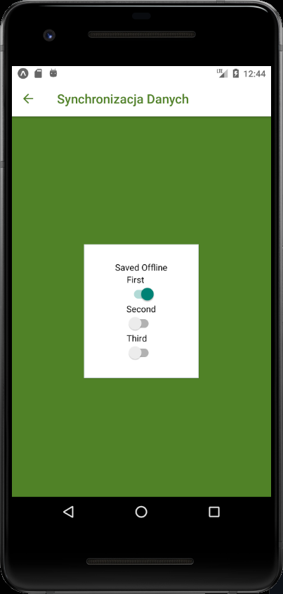

# Lab 6

<h2> Obsługa obrazów + tryb offline </h2>

<p>Z menu głównego wybieramy interesujące nas podzadanie, które było do wykonania w Lab6</p>


# Image 

<p>Na pierwszym ekranie zostały dodane 2 zdjęcia, jedno ładowane z pobranego pliku, drugi z adresu url.</p>

<br>


<p>Image.js</p>

```js

import React, { Component } from 'react';
import { Text, View, TextInput, Image } from 'react-native';
import styles from './styles';
import { Card } from 'react-native-elements'


export default class ImageComp extends Component {

  render(){
    return (
      <View style={{backgroundColor: '#1791e8', flex: 1, alignItems: 'center', justifyContent: 'space-around'}}>
        <Card>
        <Image
            source={{uri: 'https://zapodaj.net/images/d3eb72e56ad54.png'}}
            style={{width: 356,
              height: 149, }}
          />
        </Card>
        <Card>
          <Image
            source={require('../static/2.png')}
            style={{width: 356,
            height: 149, }}
          />
        </Card>
          
      </View>
    )
  }
}

```


# NetInfo


<br>

<br

<p>NetInfo.js</p>

```js

import React, { Component, useState } from 'react';
import { View, ScrollView, Text, Button } from 'react-native';
import styles from './styles';
import NetInfo from "@react-native-community/netinfo";
import { Card } from 'react-native-elements'


export default class NetInfoComp extends Component{
  NetInfoSubscribtion = null;

  constructor(props) {
    super(props);
    this.state = {
      connection_status: false,
      connection_type: null,
      connection_net_reachable: false,
      connection_wifi_enabled: false,
      connection_details: null,
    }
  }

  componentDidMount() {

    this.NetInfoSubscribtion = NetInfo.addEventListener(
      this._handleConnectivityChange,
    );

  }

  componentWillUnmount() {
    this.NetInfoSubscribtion && this.NetInfoSubscribtion();
  }

  _handleConnectivityChange = (state) => {
    this.setState({
      connection_status: state.isConnected,
      connection_type: state.type,
      connection_net_reachable: state.isInternetReachable,
      connection_wifi_enabled: state.isWifiEnabled,
      connection_details: state.details,
    })
  }
  render(){
    return (
      <View style={{backgroundColor: '#518226', flex: 1, alignItems: 'center', justifyContent: 'center' }}>
        <Card>
          <Text style={{fontSize: 20, alignSelf: 'center', padding: 6}}>Status połączenia: {this.state.connection_status ? 'Połączony' : 'Rozłączony'}</Text>
          <Text style={{fontSize: 20, alignSelf: 'center', padding: 6}}>Typ połączenia: {this.state.connection_type}</Text>
          <Text style={{fontSize: 20, alignSelf: 'center', padding: 6}}>Dostępność internetu: {this.state.connection_net_reachable ? 'Tak' : 'Nie'}</Text>
          <Text style={{fontSize: 20, alignSelf: 'center', padding: 6}}>Wifi: {this.state.connection_wifi_enabled ? 'Tak' : 'Nie'} </Text>
        </Card>
      </View>
    );
  }
}


```


# Slider

<br>

<br>

<br>


<p>Slider.js</p>

```js

import React, { Component, useState } from 'react';
import { View, Slider, Image} from 'react-native';
import styles from './styles';


export default class SliderComp extends Component {
  state = {
    firstImageScale: 1
  }
  resizeFirstImage = (value) => {
      this.setState({firstImageScale: value});
  }
  render(){
      return (
        <View style={{backgroundColor: '#e09d00', flex: 1, alignItems: 'center', justifyContent: 'space-around'}}>
          <Image  source={require('../static/smile.png')}     
                  style={{ width: 180,height: 180, transform: [{ scale: this.state.firstImageScale }] }} 
          /> 
          <Slider
              style={{width: 400, height: 40}}
              value={1}
              minimumValue={0.1}
              maximumValue={2}
              thumbTintColor='#FFFFFF'
              minimumTrackTintColor="#FFFFFF"
              maximumTrackTintColor="#000000"
              onValueChange={this.resizeFirstImage}
          />
        </View>
      );
    }
  }

```


# Lazy load

<br>

<br>

<br>

<p>LazyIcons.js</p>

```js

import React, { Component } from 'react';
import { View, Image } from 'react-native';
import styles from './styles';
import thumbnail from '../static/moon.jpg'; 
import { Icon } from 'react-native-elements'
import { Card } from 'react-native-elements'


export default class LazyIconsComp extends Component {
  render(){
    return (
      <View style={{alignItems:'center'}}>
        <Card>
        <View>
          <Image loadingIndicatorSource={thumbnail} source={{ uri: "https://i.redd.it/cft07iczdax31.jpg" }} style={{width: 356,
              height: 149, }} progressiveRenderingEnabled={false}/>
        </View>
        <View style={{padding: 10}}>
          <View style={{flexDirection:'row'}}>
            <Icon name='smile-o' type='font-awesome'/>
            <Icon name='address-book' type='font-awesome'/>
            <Icon name='address-book-o' type='font-awesome'/>
            <Icon name='address-card' type='font-awesome'/>
            <Icon name='telegram' type='font-awesome'/>
            <Icon name='microchip' type='font-awesome'/>
            <Icon name='handshake-o' type='font-awesome'/>
            <Icon name='battery-three-quarters' type='font-awesome'/>
            <Icon name='calendar-times-o' type='font-awesome'/>
            <Icon name='bullseye' type='font-awesome'/>
            <Icon name='cart-plus' type='font-awesome'/>
            <Icon name='cog' type='font-awesome'/>
            <Icon name='commenting' type='font-awesome'/>
            <Icon name='diamond' type='font-awesome'/>
          </View>
          <View style={{flexDirection:'row'}}>
            <Icon name='smile-o' type='font-awesome'/>
            <Icon name='address-book' type='font-awesome'/>
            <Icon name='address-book-o' type='font-awesome'/>
            <Icon name='address-card' type='font-awesome'/>
            <Icon name='telegram' type='font-awesome'/>
            <Icon name='microchip' type='font-awesome'/>
            <Icon name='handshake-o' type='font-awesome'/>
            <Icon name='battery-three-quarters' type='font-awesome'/>
            <Icon name='calendar-times-o' type='font-awesome'/>
            <Icon name='bullseye' type='font-awesome'/>
            <Icon name='cart-plus' type='font-awesome'/>
            <Icon name='cog' type='font-awesome'/>
            <Icon name='commenting' type='font-awesome'/>
            <Icon name='diamond' type='font-awesome'/>
          </View>
          <View style={{flexDirection:'row'}}>
            <Icon name='smile-o' type='font-awesome'/>
            <Icon name='address-book' type='font-awesome'/>
            <Icon name='address-book-o' type='font-awesome'/>
            <Icon name='address-card' type='font-awesome'/>
            <Icon name='telegram' type='font-awesome'/>
            <Icon name='microchip' type='font-awesome'/>
            <Icon name='handshake-o' type='font-awesome'/>
            <Icon name='battery-three-quarters' type='font-awesome'/>
            <Icon name='calendar-times-o' type='font-awesome'/>
            <Icon name='bullseye' type='font-awesome'/>
            <Icon name='cart-plus' type='font-awesome'/>
            <Icon name='cog' type='font-awesome'/>
            <Icon name='commenting' type='font-awesome'/>
            <Icon name='diamond' type='font-awesome'/>
          </View>
          <View style={{flexDirection:'row'}}>
            <Icon name='smile-o' type='font-awesome'/>
            <Icon name='address-book' type='font-awesome'/>
            <Icon name='address-book-o' type='font-awesome'/>
            <Icon name='address-card' type='font-awesome'/>
            <Icon name='telegram' type='font-awesome'/>
            <Icon name='microchip' type='font-awesome'/>
            <Icon name='handshake-o' type='font-awesome'/>
            <Icon name='battery-three-quarters' type='font-awesome'/>
            <Icon name='calendar-times-o' type='font-awesome'/>
            <Icon name='bullseye' type='font-awesome'/>
            <Icon name='cart-plus' type='font-awesome'/>
            <Icon name='cog' type='font-awesome'/>
            <Icon name='commenting' type='font-awesome'/>
            <Icon name='diamond' type='font-awesome'/>
          </View>
          <View style={{flexDirection:'row'}}>
            <Icon name='smile-o' type='font-awesome'/>
            <Icon name='address-book' type='font-awesome'/>
            <Icon name='address-book-o' type='font-awesome'/>
            <Icon name='address-card' type='font-awesome'/>
            <Icon name='telegram' type='font-awesome'/>
            <Icon name='microchip' type='font-awesome'/>
            <Icon name='handshake-o' type='font-awesome'/>
            <Icon name='battery-three-quarters' type='font-awesome'/>
            <Icon name='calendar-times-o' type='font-awesome'/>
            <Icon name='bullseye' type='font-awesome'/>
            <Icon name='cart-plus' type='font-awesome'/>
            <Icon name='cog' type='font-awesome'/>
            <Icon name='commenting' type='font-awesome'/>
            <Icon name='diamond' type='font-awesome'/>
          </View>
          <View style={{flexDirection:'row'}}>
            <Icon name='smile-o' type='font-awesome'/>
            <Icon name='address-book' type='font-awesome'/>
            <Icon name='address-book-o' type='font-awesome'/>
            <Icon name='address-card' type='font-awesome'/>
            <Icon name='telegram' type='font-awesome'/>
            <Icon name='microchip' type='font-awesome'/>
            <Icon name='handshake-o' type='font-awesome'/>
            <Icon name='battery-three-quarters' type='font-awesome'/>
            <Icon name='calendar-times-o' type='font-awesome'/>
            <Icon name='bullseye' type='font-awesome'/>
            <Icon name='cart-plus' type='font-awesome'/>
            <Icon name='cog' type='font-awesome'/>
            <Icon name='commenting' type='font-awesome'/>
            <Icon name='diamond' type='font-awesome'/>
          </View>
          <View style={{flexDirection:'row'}}>
            <Icon name='smile-o' type='font-awesome'/>
            <Icon name='address-book' type='font-awesome'/>
            <Icon name='address-book-o' type='font-awesome'/>
            <Icon name='address-card' type='font-awesome'/>
            <Icon name='telegram' type='font-awesome'/>
            <Icon name='microchip' type='font-awesome'/>
            <Icon name='handshake-o' type='font-awesome'/>
            <Icon name='battery-three-quarters' type='font-awesome'/>
            <Icon name='calendar-times-o' type='font-awesome'/>
            <Icon name='bullseye' type='font-awesome'/>
            <Icon name='cart-plus' type='font-awesome'/>
            <Icon name='cog' type='font-awesome'/>
            <Icon name='commenting' type='font-awesome'/>
            <Icon name='diamond' type='font-awesome'/>
          </View>
          <View style={{flexDirection:'row'}}>
            <Icon name='smile-o' type='font-awesome'/>
            <Icon name='address-book' type='font-awesome'/>
            <Icon name='address-book-o' type='font-awesome'/>
            <Icon name='address-card' type='font-awesome'/>
            <Icon name='telegram' type='font-awesome'/>
            <Icon name='microchip' type='font-awesome'/>
            <Icon name='handshake-o' type='font-awesome'/>
            <Icon name='battery-three-quarters' type='font-awesome'/>
            <Icon name='calendar-times-o' type='font-awesome'/>
            <Icon name='bullseye' type='font-awesome'/>
            <Icon name='cart-plus' type='font-awesome'/>
            <Icon name='cog' type='font-awesome'/>
            <Icon name='commenting' type='font-awesome'/>
            <Icon name='diamond' type='font-awesome'/>
          </View>
          <View style={{flexDirection:'row'}}>
            <Icon name='smile-o' type='font-awesome'/>
            <Icon name='address-book' type='font-awesome'/>
            <Icon name='address-book-o' type='font-awesome'/>
            <Icon name='address-card' type='font-awesome'/>
            <Icon name='telegram' type='font-awesome'/>
            <Icon name='microchip' type='font-awesome'/>
            <Icon name='handshake-o' type='font-awesome'/>
            <Icon name='battery-three-quarters' type='font-awesome'/>
            <Icon name='calendar-times-o' type='font-awesome'/>
            <Icon name='bullseye' type='font-awesome'/>
            <Icon name='cart-plus' type='font-awesome'/>
            <Icon name='cog' type='font-awesome'/>
            <Icon name='commenting' type='font-awesome'/>
            <Icon name='diamond' type='font-awesome'/>
          </View>
          <View style={{flexDirection:'row'}}>
            <Icon name='smile-o' type='font-awesome'/>
            <Icon name='address-book' type='font-awesome'/>
            <Icon name='address-book-o' type='font-awesome'/>
            <Icon name='address-card' type='font-awesome'/>
            <Icon name='telegram' type='font-awesome'/>
            <Icon name='microchip' type='font-awesome'/>
            <Icon name='handshake-o' type='font-awesome'/>
            <Icon name='battery-three-quarters' type='font-awesome'/>
            <Icon name='calendar-times-o' type='font-awesome'/>
            <Icon name='bullseye' type='font-awesome'/>
            <Icon name='cart-plus' type='font-awesome'/>
            <Icon name='cog' type='font-awesome'/>
            <Icon name='commenting' type='font-awesome'/>
            <Icon name='diamond' type='font-awesome'/>
          </View>
          <View style={{flexDirection:'row'}}>
            <Icon name='smile-o' type='font-awesome'/>
            <Icon name='address-book' type='font-awesome'/>
            <Icon name='address-book-o' type='font-awesome'/>
            <Icon name='address-card' type='font-awesome'/>
            <Icon name='telegram' type='font-awesome'/>
            <Icon name='microchip' type='font-awesome'/>
            <Icon name='handshake-o' type='font-awesome'/>
            <Icon name='battery-three-quarters' type='font-awesome'/>
            <Icon name='calendar-times-o' type='font-awesome'/>
            <Icon name='bullseye' type='font-awesome'/>
            <Icon name='cart-plus' type='font-awesome'/>
            <Icon name='cog' type='font-awesome'/>
            <Icon name='commenting' type='font-awesome'/>
            <Icon name='diamond' type='font-awesome'/>
          </View>
          <View style={{flexDirection:'row'}}>
            <Icon name='smile-o' type='font-awesome'/>
            <Icon name='address-book' type='font-awesome'/>
            <Icon name='address-book-o' type='font-awesome'/>
            <Icon name='address-card' type='font-awesome'/>
            <Icon name='telegram' type='font-awesome'/>
            <Icon name='microchip' type='font-awesome'/>
            <Icon name='handshake-o' type='font-awesome'/>
            <Icon name='battery-three-quarters' type='font-awesome'/>
            <Icon name='calendar-times-o' type='font-awesome'/>
            <Icon name='bullseye' type='font-awesome'/>
            <Icon name='cart-plus' type='font-awesome'/>
            <Icon name='cog' type='font-awesome'/>
            <Icon name='commenting' type='font-awesome'/>
            <Icon name='diamond' type='font-awesome'/>
          </View>
          <View style={{flexDirection:'row'}}>
            <Icon name='smile-o' type='font-awesome'/>
            <Icon name='address-book' type='font-awesome'/>
            <Icon name='address-book-o' type='font-awesome'/>
            <Icon name='address-card' type='font-awesome'/>
            <Icon name='telegram' type='font-awesome'/>
            <Icon name='microchip' type='font-awesome'/>
            <Icon name='handshake-o' type='font-awesome'/>
            <Icon name='battery-three-quarters' type='font-awesome'/>
            <Icon name='calendar-times-o' type='font-awesome'/>
            <Icon name='bullseye' type='font-awesome'/>
            <Icon name='cart-plus' type='font-awesome'/>
            <Icon name='cog' type='font-awesome'/>
            <Icon name='commenting' type='font-awesome'/>
            <Icon name='diamond' type='font-awesome'/>
          </View>
          <View style={{flexDirection:'row'}}>
            <Icon name='smile-o' type='font-awesome'/>
            <Icon name='address-book' type='font-awesome'/>
            <Icon name='address-book-o' type='font-awesome'/>
            <Icon name='address-card' type='font-awesome'/>
            <Icon name='telegram' type='font-awesome'/>
            <Icon name='microchip' type='font-awesome'/>
            <Icon name='handshake-o' type='font-awesome'/>
            <Icon name='battery-three-quarters' type='font-awesome'/>
            <Icon name='calendar-times-o' type='font-awesome'/>
            <Icon name='bullseye' type='font-awesome'/>
            <Icon name='cart-plus' type='font-awesome'/>
            <Icon name='cog' type='font-awesome'/>
            <Icon name='commenting' type='font-awesome'/>
            <Icon name='diamond' type='font-awesome'/>
          </View>
        </View>
        </Card>
      </View >
  );
  }
}


```


# Synchronizacja danych

<br>

<br>

<br>

<br>

<p>SynchDane.js</p>

```js

import React, { useState, useEffect } from 'react';
import { View, Text,Button, TouchableOpacity, TextInput, SafeAreaView, StyleSheet, ScrollView, Image,Switch } from 'react-native';
import styles from './styles';
import { set, get } from "./Store";
import NetInfo from "@react-native-community/netinfo";
import { Card } from 'react-native-elements'


const boolMap = {
  true: true,
  false: false
};

export default function SynchDaneComp() {

  const [message, setMessage] = useState(null);
    const [first, setFirst] = useState(false);
    const [second, setSecond] = useState(false);
    const [third, setThird] = useState(false);
    const setters = new Map([
      ["first", setFirst],
      ["second", setSecond],
      ["third", setThird]
    ]);

    function save(key) {
      return value => {
        set(key, value).then(
          connected => {
            setters.get(key)(value);
            setMessage(connected ? "Saved Online" : "Saved Offline");
          },
          err => {
            setMessage(err);
          }
        );
      };
    }
    
    useEffect(() => {
      NetInfo.fetch().then(() =>
        get().then(
          items => {
            for (let [key, value] of Object.entries(items)) {
              setters.get(key)(value);
            }
          },
          err => {
            setMessage(err);
          }
        )
      );
    }, []);
    return (
      <View style={{backgroundColor: '#518226', flex: 1, alignItems: 'center', justifyContent: 'space-around'}}>
        <Card>
          <View style={{width: 150, height: 180, justifyContent: 'center', alignItems: 'center'}}>

            <Text>{message}</Text>
            <View>
              <Text>First</Text>
              <Switch
                value={boolMap[first.toString()]}
                onValueChange={save("first")}
              />
            </View>
            <View>
              <Text>Second</Text>
              <Switch
                value={boolMap[second.toString()]}
                onValueChange={save("second")}
              />
            </View>
            <View>
              <Text>Third</Text>
              <Switch
                value={boolMap[third.toString()]}
                onValueChange={save("third")}
              />
            </View>
          </View>
        </Card>
      </View>
  );
}

```

<p>Store.js</p>

```js

import AsyncStorage from '@react-native-async-storage/async-storage';
import NetInfo from "@react-native-community/netinfo";


const fakeNetworkData = {
  first: false,
  second: false,
  third: false
};

let connected = false;
const unsynced = [];
export function set(key, value) {
  return new Promise((resolve, reject) => {
    if (connected) {
      fakeNetworkData[key] = value;
      resolve(true);
    } else {
      AsyncStorage.setItem(key, value.toString()).then(
        () => {
          unsynced.push(key);
          resolve(false);
        },
        err => reject(err)
      );
    }
  });
}


export function get(key) {
  return new Promise((resolve, reject) => {
    if (connected) {
      resolve(key ? fakeNetworkData[key] : fakeNetworkData);
    } else if (key) {
      AsyncStorage.getItem(key).then(
        item => resolve(item),
        err => reject(err)
      );
      
    } else {
      AsyncStorage.getAllKeys().then(
        keys =>
          AsyncStorage.multiGet(keys).then(
            items => resolve(Object.fromEntries(items)),
            err => reject(err)
          ),
        err => reject(err)
      );
    }
  });
}

NetInfo.fetch().then(
  connection => {
    connected = ["wifi", "unknown"].includes(connection.type);
  },
  () => {
    connected = false;
  }
);


NetInfo.addEventListener(connection => {
  connected = ["wifi", "unknown"].includes(connection.type);

  if (connected && unsynced.length) {
    AsyncStorage.multiGet(unsynced).then(items => {
      items.forEach(([key, val]) => set(key, val));
      unsynced.length = 0;
    });
  }
});

```


# Async Storage

<br>

<br>

<br>


<p>AsyncStorage.js</p>

```js

import React, { Component, useEffect, useState } from 'react';
import { Button, Text,TextInput, View } from 'react-native';
import styles from './styles';
import AsyncStorage from '@react-native-async-storage/async-storage';
import { Card } from 'react-native-elements'
import { Icon } from 'react-native-elements'


export default class AsyncStorageComp extends Component {
  constructor(){
    super()
  }
  state = {
      Key:'',
      Value:'',
      readKey:''
  }
  storeData = async () => {
      var key = this.state.Key
      var value = this.state.Value
      console.log(key)
      console.log(value)
      await AsyncStorage.setItem(key,value);
      console.log(await AsyncStorage.getItem(key))
  };
  retrieveData = async () => {
      var key = this.state.readKey
      const value = await AsyncStorage.getItem(key);
      if (value !== null) {
          alert('Klucz '+key+' ma wartość '+value);
      }else{
          alert('Podany element nie istnieje');
      }
  };
  render(){
    return (
      <View style={{backgroundColor: '#e09d00', flex: 1, alignItems: 'center', justifyContent: 'space-around'}}>

      <Card>
        <View>
            <Text style={{alignSelf: 'center'}}>Podaj wartość do zapisania</Text>

            <View style={{flexDirection: 'row', paddingRight: 20}}>
                <Icon name='key' type='font-awesome' color='#e09d00' size={15} style={{paddingTop: 6, paddingRight: 6}}/>
                <TextInput onEndEditing={event =>{this.setState({Key: event.nativeEvent.text})}} placeholder="Podaj klucz" style={{borderBottomWidth: 1, borderBottomColor: '#e09d00', width: 150 }} />
            </View>

            <View style={{flexDirection: 'row'}}>
                <Icon name='arrow-right' type='font-awesome' color='#e09d00' size={15} style={{paddingTop: 6, paddingRight: 6}}/>
                <TextInput onEndEditing={event =>{this.setState({Value: event.nativeEvent.text})}} placeholder="Wpisz wartość" style={{borderBottomWidth: 1, borderBottomColor: '#e09d00', width: 150 }} />
            </View>
            <View style={{alignItems: 'center'}}>
              <Icon raised name='plus-circle' type='font-awesome' onPress={this.storeData} color='#e09d00'/>
            </View>
            
        </View>
        
        <View style={{paddingTop: 20}}>
          
            <Text style={{alignSelf: 'center'}}>Podaj klucz, aby odczytać dane</Text>
            <View style={{flexDirection: 'row', paddingRight: 20}}>
                <Icon name='key' type='font-awesome' color='#e09d00' size={15} style={{paddingTop: 6, paddingRight: 6}}/>
                <TextInput onEndEditing={event =>{this.setState({readKey: event.nativeEvent.text})}} placeholder="Wpisz klucz" style={{borderBottomWidth: 1, borderBottomColor: '#e09d00', width: 150 }}/>
            </View>
            <View style={{alignItems: 'center'}}>
              <Icon raised name='search' type='font-awesome' onPress={this.retrieveData} color='#e09d00'/>
            </View>
        </View>
      </Card>


      </View >
  );
  }
}


```


