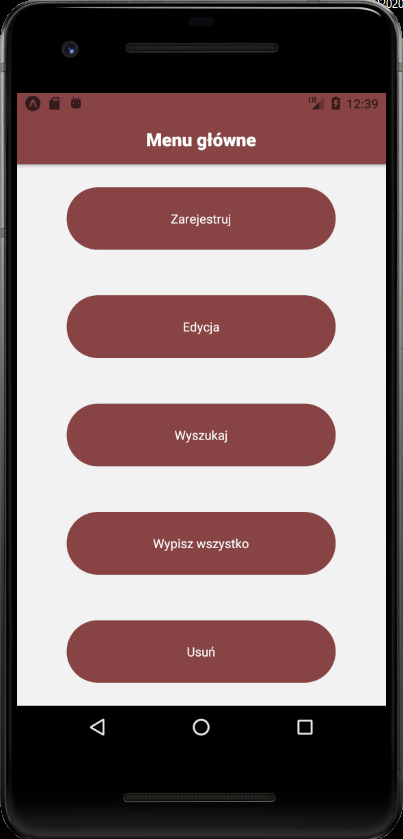
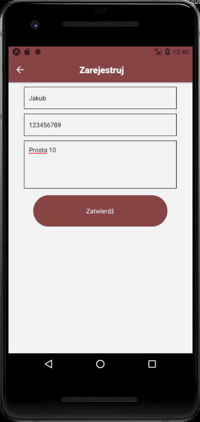
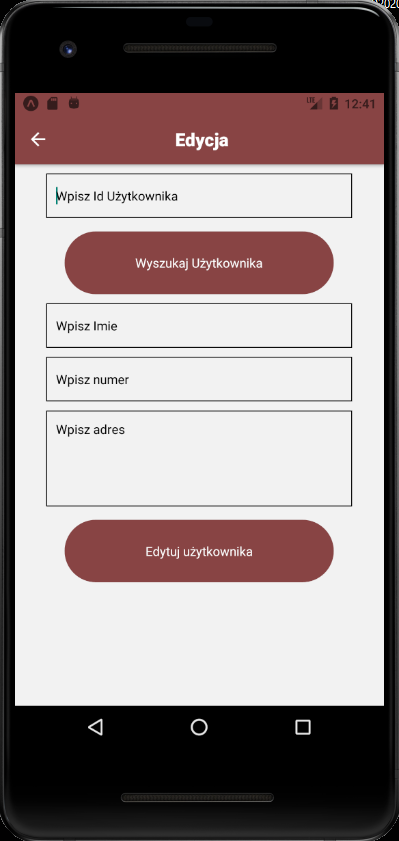
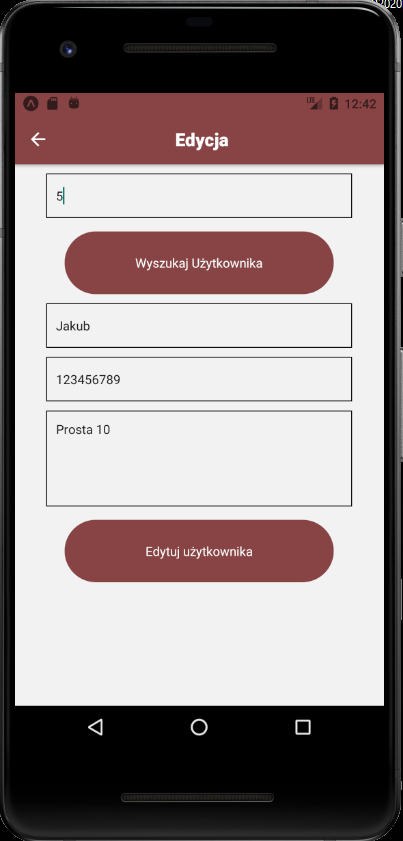
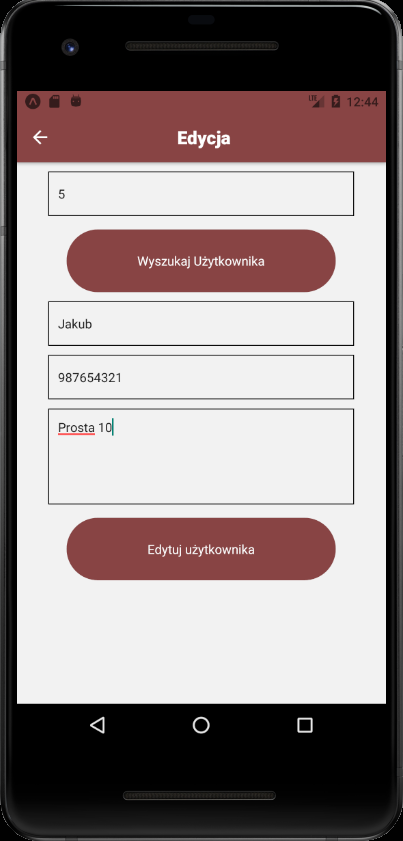
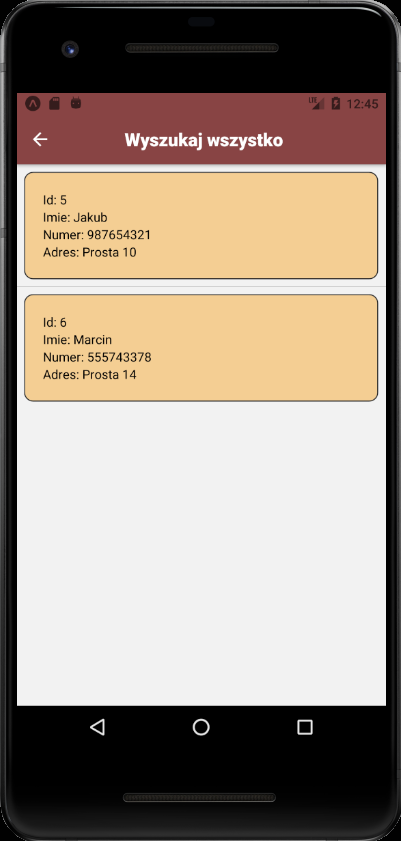
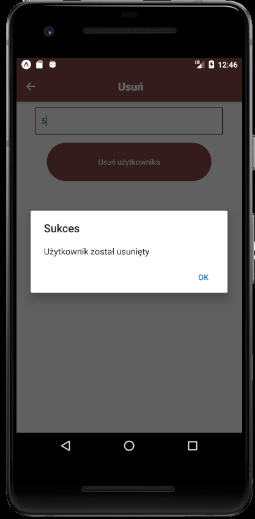
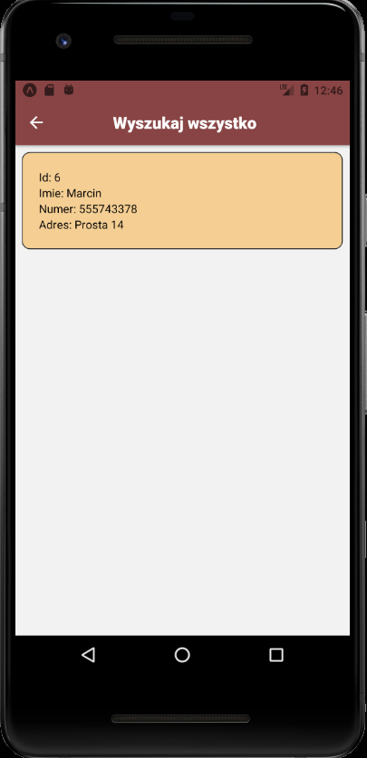

# Lab 7

<h2> Wykorzystanie bazy danych w aplikacji mobilnej </h2>

<p>Z menu głównego wybieramy interesujące nas zadanie, do wykonania. Możemy zarejestrować użytkownika, wyświetlić pojedyńczego bądź wszystkich, zedytować jego dane oraz usunąć go. Baza danych jest tworzona w momencie uruchomienia aplikacji.</p>



<p>Start.js</p>

```js

import React, { useEffect } from 'react';
import { View, Text, SafeAreaView} from 'react-native';
import styles from './styles';
import Mybutton from './Mybutton';
import Mytext from './Mytext';
import * as SQLite from 'expo-sqlite';

var db = SQLite.openDatabase("UserDatabase.db");

const Start = ({ navigation }) => {
    useEffect(() => {
      db.transaction(function (txn) {
        txn.executeSql(
          "SELECT name FROM sqlite_master WHERE type='table' AND name='table_user'",
          [],
          function (tx, res) {
            console.log('item:', res.rows.length);
            if (res.rows.length == 0) {
              txn.executeSql('DROP TABLE IF EXISTS table_user', []);
              txn.executeSql(
                'CREATE TABLE IF NOT EXISTS table_user(user_id INTEGER PRIMARY KEY AUTOINCREMENT, user_name VARCHAR(20), user_contact INT(10), user_address VARCHAR(255))',
                []
              );
            }
          }
        );
      });
    }, []);
  
    return (
      <View style={{ flex: 1, flexDirection: 'column',justifyContent: 'space-around',alignItems: 'center'}}>
        <Mybutton
          title="Zarejestruj"
          customClick={() => navigation.navigate('Zarejestruj')}
        />
        <Mybutton
          title="Edycja"
          customClick={() => navigation.navigate('Edycja')}
        />
        <Mybutton
          title="Wyszukaj"
          customClick={() => navigation.navigate('Wyszukaj')}
        />
        <Mybutton
          title="Wypisz wszystko"
          customClick={() => navigation.navigate('WyszukajAll')}
        />
        <Mybutton
          title="Usuń"
          customClick={() => navigation.navigate('Usun')}
        />
      </View>
    );
  };
  
  export default Start;


```


# Zarejestruj

<p>Podajemy imię użytkownika, jego numer telefonu oraz adres zamieszkania. Po dodaniu wyświetli nam się odpowiedni alert, zależny czy operacja przebiegła prawidłowo.</p>

<br>


<p>Zarejestruj.js</p>

```js

import React, { useState } from 'react';
import { View, ScrollView, KeyboardAvoidingView, Alert, SafeAreaView, Text } from 'react-native';
import styles from './styles';
import { Card } from 'react-native-elements'
import Mytextinput from './Mytextinput';
import Mybutton from './Mybutton';
import * as SQLite from 'expo-sqlite';

var db = SQLite.openDatabase("UserDatabase.db");

const Zarejestruj = ({ navigation }) => {
  let [userName, setUserName] = useState('');
  let [userContact, setUserContact] = useState('');
  let [userAddress, setUserAddress] = useState('');

  let register_user = () => {
    console.log(userName, userContact, userAddress);

    if (!userName) {
      alert('Wpisz Imie');
      return;
    }
    if (!userContact) {
      alert('Wpisz Numer');
      return;
    }
    if (!userAddress) {
      alert('Wpisz Adres');
      return;
    }

    db.transaction(function (tx) {
      tx.executeSql(
        'INSERT INTO table_user (user_name, user_contact, user_address) VALUES (?,?,?)',
        [userName, userContact, userAddress],
        (tx, results) => {
          console.log('Results', results.rowsAffected);
          if (results.rowsAffected > 0) {
            Alert.alert(
              'Sukces',
              'Rejestracja powiodła się',
              [
                {
                  text: 'Ok',
                  onPress: () => navigation.navigate('Start'),
                },
              ],
              { cancelable: false }
            );
          } else alert('Rejestracja nie powiodła się');
        }
      );
    });
  };

  
  return (
            <View>
              <Mytextinput
                placeholder="Wpisz Imie"
                onChangeText={
                  (userName) => setUserName(userName)
                }
                style={{ padding: 10 }}
              />
              <Mytextinput
                placeholder="Wpisz Numer"
                onChangeText={
                  (userContact) => setUserContact(userContact)
                }
                maxLength={10}
                keyboardType="numeric"
                style={{ padding: 10 }}
              />
              <Mytextinput
                placeholder="Wpisz Adres"
                onChangeText={
                  (userAddress) => setUserAddress(userAddress)
                }
                maxLength={225}
                numberOfLines={5}
                multiline={true}
                style={{ textAlignVertical: 'top', padding: 10 }}
              />
              <View style={{ alignItems: 'center', paddingTop: 15 }}>
                <Mybutton title="Zatwierdź" customClick={register_user}/>
              </View>
            </View>
  )
  
}

export default Zarejestruj;

```


# Edycja


<br>
<p>Po uzupełnieniu textinputu z ID użytkownika, możliwa będzie edycja danych wyświetlona poniżej.</p>

<br>
<p>Dla sprawdzenia funkcjonalności, został zmieniony numer telefonu użytkownikowi o ID 5 .</p>


<p>Edycja.js</p>

```js

import React, { useState } from 'react';
import { View, ScrollView, Text, Button, SafeAreaView, KeyboardAvoidingView } from 'react-native';
import styles from './styles';
import NetInfo from "@react-native-community/netinfo";
import { Card } from 'react-native-elements'
import * as SQLite from 'expo-sqlite';
import Mytextinput from './Mytextinput';
import Mybutton from './Mybutton';

var db = SQLite.openDatabase("UserDatabase.db");


const Edycja = ({ navigation }) => {
  let [inputUserId, setInputUserId] = useState('');
  let [userName, setUserName] = useState('');
  let [userContact, setUserContact] = useState('');
  let [userAddress, setUserAddress] = useState('');

  let updateAllStates = (name, contact, address) => {
    setUserName(name);
    setUserContact(contact);
    setUserAddress(address);
  };

  let searchUser = () => {
    console.log(inputUserId);
    db.transaction((tx) => {
      tx.executeSql(
        'SELECT * FROM table_user where user_id = ?',
        [inputUserId],
        (tx, results) => {
          var len = results.rows.length;
          if (len > 0) {
            let res = results.rows.item(0);
            updateAllStates(
              res.user_name,
              res.user_contact,
              res.user_address
            );
          } else {
            alert('Nie znalezionu użytkownika');
            updateAllStates('', '', '');
          }
        }
      );
    });
  };
  let updateUser = () => {
    console.log(inputUserId, userName, userContact, userAddress);

    if (!inputUserId) {
      alert('Wpisz Id');
      return;
    }
    if (!userName) {
      alert('Wpisz imie');
      return;
    }
    if (!userContact) {
      alert('Wpisz numer');
      return;
    }
    if (!userAddress) {
      alert('Wpisz adres');
      return;
    }

    db.transaction((tx) => {
      tx.executeSql(
        'UPDATE table_user set user_name=?, user_contact=? , user_address=? where user_id=?',
        [userName, userContact, userAddress, inputUserId],
        (tx, results) => {
          console.log('Results', results.rowsAffected);
          if (results.rowsAffected > 0) {
            Alert.alert(
              'Sukces',
              'Użytkonik zmieniony',
              [
                {
                  text: 'Ok',
                  onPress: () => navigation.navigate('Start'),
                },
              ],
              { cancelable: false }
            );
          } else alert('Edycja nieudana');
        }
      );
    });
  };
  
  return (
    
        <View>
              <Mytextinput
                placeholder="Wpisz Id Użytkownika"
                style={{ padding: 10 }}
                onChangeText={
                  (inputUserId) => setInputUserId(inputUserId)
                }
              />
              <View style={{ alignItems: 'center', paddingTop: 15 }}>
                <Mybutton title="Wyszukaj Użytkownika" customClick={searchUser} />
              </View>
              <Mytextinput
                placeholder="Wpisz Imie"
                value={userName}
                style={{ padding: 10 }}
                onChangeText={
                  (userName) => setUserName(userName)
                }
              />
              <Mytextinput
                placeholder="Wpisz numer"
                value={'' + userContact}
                onChangeText={
                  (userContact) => setUserContact(userContact)
                }
                maxLength={10}
                style={{ padding: 10 }}
                keyboardType="numeric"
              />
              <Mytextinput
                value={userAddress}
                placeholder="Wpisz adres"
                onChangeText={
                  (userAddress) => setUserAddress(userAddress)
                }
                maxLength={225}
                numberOfLines={5}
                multiline={true}
                style={{ textAlignVertical: 'top', padding: 10 }}
              />
              <View style={{ alignItems: 'center', paddingTop: 15 }}>
                <Mybutton title="Edytuj użytkownika" customClick={updateUser}/>
              </View>
        </View>
      
  );
  
}
export default Edycja;


```


# Wyszukaj

<br>
<p>Po wpisaniu ID użytkownika, możemy sprawdzić jego dane. Wcześniejsza zmiana numeru telefonu jest widoczna.</p>


<p>Wyszukaj.js</p>

```js

import React, { Component, useState } from 'react';
import { View, SafeAreaView, Text} from 'react-native';
import styles from './styles';
import * as SQLite from 'expo-sqlite';
import Mytextinput from './Mytextinput';
import Mybutton from './Mybutton';

var db = SQLite.openDatabase("UserDatabase.db");


const Wyszukaj = () => {
  let [inputUserId, setInputUserId] = useState('');
  let [userData, setUserData] = useState({});

  let searchUser = () => {
    console.log(inputUserId);
    setUserData({});
    db.transaction((tx) => {
      tx.executeSql(
        'SELECT * FROM table_user where user_id = ?',
        [inputUserId],
        (tx, results) => {
          var len = results.rows.length;
          console.log('len', len);
          if (len > 0) {
            setUserData(results.rows.item(0));
          } else {
            alert('Nie znaleziono użytkownika');
          }
        }
      );
    });
  };
  return (
    
        <View>
          <Mytextinput
            placeholder="Wpisz Id Użytkownika"
            onChangeText={
              (inputUserId) => setInputUserId(inputUserId)
            }
            style={{ padding: 10 }}
          />
          <View style={{ alignItems: 'center', paddingTop: 15 }}>
            <Mybutton title="Wyszukaj Użytkownika" customClick={searchUser} />
          </View>
          <View
            style={{
              marginLeft: 35,
              marginRight: 35,
              marginTop: 10
            }}>
            <Text>User Id: {userData.user_id}</Text>
            <Text>User Name: {userData.user_name}</Text>
            <Text>User Contact: {userData.user_contact}</Text>
            <Text>User Address: {userData.user_address}</Text>
          
          
          </View>
        </View>
      
  );
}
export default Wyszukaj;
 
```


# Wyszukaj wszystko

<br>
<p>Zostają wyświetleni wszyscy poprzednio dodani użytkownicy.</p>


<p>WyszukajAll.js</p>

```js

import React, { useState, useEffect } from 'react';
import { View, FlatList, Text, SafeAreaView } from 'react-native';
import styles from './styles';
import { Icon } from 'react-native-elements'
import { Card } from 'react-native-elements'
import * as SQLite from 'expo-sqlite';


var db = SQLite.openDatabase("UserDatabase.db");


const WyszukajAll = () => {
  let [flatListItems, setFlatListItems] = useState([]);

  useEffect(() => {
    db.transaction((tx) => {
      tx.executeSql(
        'SELECT * FROM table_user',
        [],
        (tx, results) => {
          var temp = [];
          for (let i = 0; i < results.rows.length; ++i)
            temp.push(results.rows.item(i));
          setFlatListItems(temp);
          
          console.log(flatListItems);
        }
      );
    });
  }, []);

  let listViewItemSeparator = () => {
    return (
      <View
        style={{
          height: 0.2,
          width: '100%',
          backgroundColor: '#808080'
        }}
      />
    );
  };

  let listItemView = (item) => {
    return (
      <View
        key={item.user_id}
        style={{margin:'2%', backgroundColor: '#F4CE93', padding: 20 ,borderWidth: 1, borderColor:'black',borderRadius:10 }}>
        <Text>Id: {item.user_id}</Text>
        <Text>Imie: {item.user_name}</Text>
        <Text>Numer: {item.user_contact}</Text>
        <Text>Adres: {item.user_address}</Text>
      </View>
    );
  };
  return (
        <View style={{ flex: 1 }}>
          <FlatList
            data={flatListItems}
            ItemSeparatorComponent={listViewItemSeparator}
            keyExtractor={(item, index) => index.toString()}
            renderItem={({ item }) => listItemView(item)}
          />
        </View>
  );
}
export default WyszukajAll;


```


# Usuń

<br>
<p>Po wpisaniu ID użytkownika, zostanie on usunięty z bazy.</p>

<br>
<p>Po przejściu w "Wyświetl wszystko" nasz usunięty użytkownik nie wyświetla się.</p>


<p>Usun.js</p>

```js

import React, { useState } from 'react';
import { Text, View, Alert, SafeAreaView } from 'react-native';
import styles from './styles';
import Mytextinput from './Mytextinput';
import Mybutton from './Mybutton';
import * as SQLite from 'expo-sqlite';


var db = SQLite.openDatabase("UserDatabase.db");

const Usun = ({ navigation }) => {
  let [inputUserId, setInputUserId] = useState('');

  let deleteUser = () => {
    db.transaction((tx) => {
      tx.executeSql(
        'DELETE FROM  table_user where user_id=?',
        [inputUserId],
        (tx, results) => {
          console.log('Results', results.rowsAffected);
          if (results.rowsAffected > 0) {
            Alert.alert(
              'Sukces',
              'Użytkownik został usunięty',
              [
                {
                  text: 'Ok',
                  onPress: () => navigation.navigate('Start'),
                },
              ],
              { cancelable: false }
            );
          } else {
            alert('Wpisz poprawne Id');
          }
        }
      );
    });
  };
  return (
    <View>
      <Mytextinput
        placeholder="Wpisz Id Użytkownika"
        onChangeText={
          (inputUserId) => setInputUserId(inputUserId)
        }
        style={{ padding: 10 }}
      />
      <View style={{ alignItems: 'center', paddingTop: 15 }}>
        <Mybutton title="Usuń użytkownika" customClick={deleteUser} />
      </View>
    </View>
  );
}
export default Usun;

```


